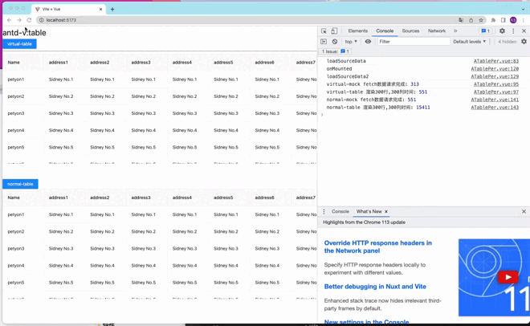
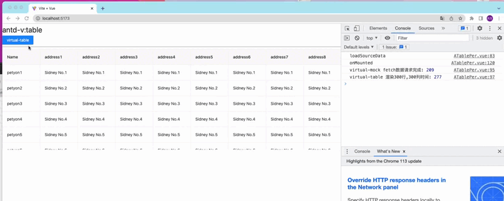

# 介绍

<br />
<br />
<div style="text-align:center">
<b style="font-size:30px">ATableVirtual</b>
<p>适用于a-table的虚拟滚动表格插件</p>

<div>
  
</div>
</div>

**ATableVirtual**是一个基于 **Vue3** 、**ant-design-vue**、 **a-table**组件开发,更加轻量级的插件,让我们能更专注于业务组件的开发。
<p style="font-size:12px">tips:目前仅适用于v3版本，v2版本ing</p>

### ✨ 特性  
- 🌈 **ATableVirtual**暂时的目标是打造一个1千行&&1千列的性能王者，如果有大量数据需要渲染，界面可能会出现抖动。
- 📦 开箱即用的**a-table-virtual**组件,更加轻量级、少侵入性代码、无需改造业务代码。
- 🎨 如果有庞大业务需求，还是建议使用商业版本的 [Surely Vue Table](https://www.surely.cool/doc/guide#快速开始)，但是很遗憾，这是一个商业化组件。并不能直接使用。

### 🌈 效果
<p>
可以看到使用了虚拟表格的加载方式，渲染300行300列的数据大概耗时300ms，而普通加载方式约7000ms左右。
</p>

<div>
  
</div>
<p style="margin-top:30px">
使用虚拟表格的滚动效果
</p>
<div>
  
</div>


### 🤝 问题反馈

  [问题反馈](https://github.com/BigPengZai/atd-table-virtual/issues)


### 🔗 官网地址

  [atd-table-virtual](https://bigpengzai.github.io/ssgcmpstep1/)


###  📦 安装

```javascript
// 安装插件
    npm i a-table-virtual
```

```javascript
// 导入插件
    import VirtualTablePlugin from "a-table-virtual";
    app.use(VirtualTablePlugin);
```
### 🔨 示例
```javascript
// 在组件中使用
    <a-table
      v-virtual-table-scroll
      :columns="columns"
      :data-source="dataList.slice(start, over)"
      bordered
      :pagination="false"
      :scroll="{ x: 0, y: scrollHeight }"
    >
    </a-table>

    <script setup>

    import {inject } from "vue";
    const { start, over } = inject("dataListOptions");
    let scrollHeight = 300;

    </script>

```


### ⚙️ 为什么要去搞这个轮子

- 在前端开发领域，表格一直都是一个高频出现的组件，尤其是在中后台和数据分析场景。 但是，对于Table来说，当一屏里超过 1000 条数据记录时，就会出现卡顿等性能问题，体验不是很好。

- 通过虚拟化表格组件，超大数据渲染将不再是一个头疼的问题。
- 针对于目前 ant-design-vue 中的 [Surely Vue Table](https://www.surely.cool/doc/guide#快速开始),很遗憾，这是一个商业化组件。并不能直接使用。


### 功能点

以下是当前已经支持和正在开发中的功能，如果感兴趣可以一起~~。


| 功能         | 状态 |
| ------------ | ---- |
| Y轴的虚拟滚动   | ✅   |
| X轴的方向的懒加载   | ✅   |
| X轴 && Y轴的虚拟滚动         | 🚧   |
| V2版本的支持    | 🚧   |
| 暴露按需加载的load方法    | 🚧   |
